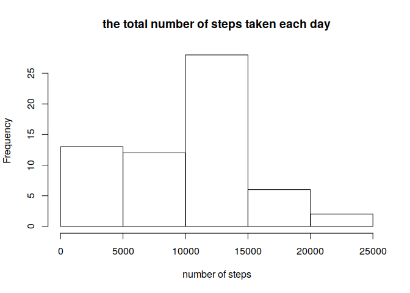
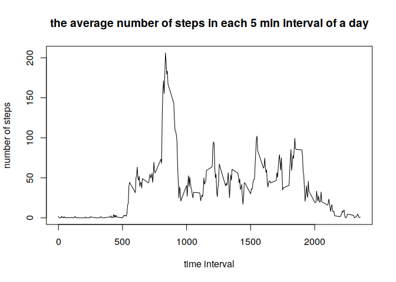
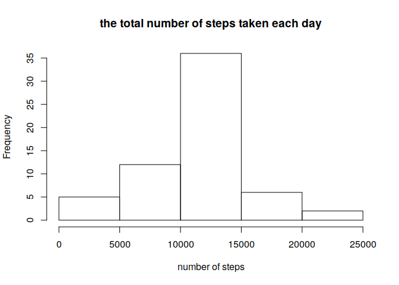
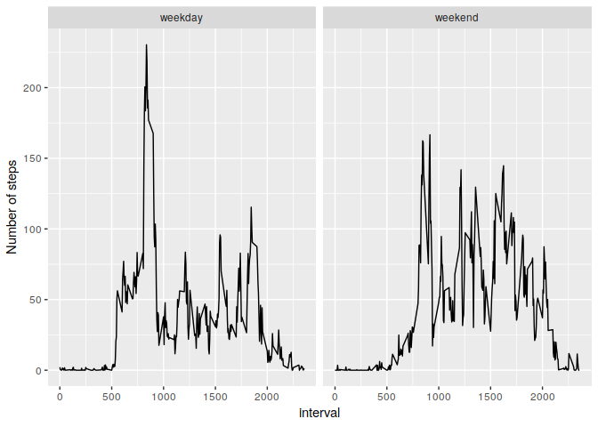

## Loading and preprocessing the data
Data is already in repository so no downloading needed
Transforming the date factor to date 


```r
library("dplyr")
```

```
## 
## Attaching package: 'dplyr'
```

```
## The following objects are masked from 'package:stats':
## 
##     filter, lag
```

```
## The following objects are masked from 'package:base':
## 
##     intersect, setdiff, setequal, union
```

```r
#library("ggplot2")
raw <- read.csv(unzip("activity.zip"))
# converting factor to actual date
raw$date <- as.Date(raw$date)
```

## What is mean total number of steps taken per day?
Plotting a histogram showing the distrobution of total steps


```r
totsteps <-raw %>% group_by(date) %>% 
  summarise(totalsteps=sum(steps,na.rm=TRUE))    
hist(totsteps$totalsteps, xlab = "number of steps",
     main = "the total number of steps taken each day")
```

<!-- -->

```r
meansteps <- mean(totsteps$totalsteps)

mediansteps <- median(totsteps$totalsteps)
```

The mean and median number of steps taken per day are 9354.2295082
and 10395, respectively.

## What is the average daily activity pattern?
Plotting a lineplot of the average steps over a day in five minute intervals


```r
totsteps <-raw %>% group_by(interval) %>% 
  summarise(aversteps=mean(steps,na.rm=TRUE))
# keep in mind that intervall only goes up to 60 for the minutes
plot(totsteps$interval,totsteps$aversteps,type = "l", 
     xlab = "time interval", 
     ylab = "number of steps",
     main = "the average number of steps in each 5 min interval of a day")
```

<!-- -->

```r
# adding a ":" assuming that the interval is after 1 am
highstav <- gsub("^([0-9]*)([0-9]{2})$","\\1:\\2",
                 totsteps$interval[which.max(totsteps$aversteps)])
```

The five minute interval with the highest average activity starts at 
8:35.

## Imputing missing values

```r
naindex <- is.na(raw$steps)
presentna <- length(raw$steps[naindex])
```

The number of entries with NA values is 2304.

We replace the NA value in an interval by the average of the interval at
other days

```r
newraw <- 
  left_join(raw,totsteps, by="interval") %>% 
  transmute(steps = coalesce(steps,as.integer(aversteps)), date=date,
            interval =interval)
  #apply( 1, function(row) if(is.na(row[1])) as.integer(row[4]) else row[1] )

totsteps <- newraw %>% group_by(date) %>% 
  summarise(totalsteps=sum(steps,na.rm=FALSE))    
hist(totsteps$totalsteps, xlab = "number of steps",
     main = "the total number of steps taken each day")
```

<!-- -->

```r
newmeansteps <- mean(totsteps$totalsteps)

newmediansteps <- median(totsteps$totalsteps)
```
The new mean and median number of steps taken per day are 1.074977\times 10^{4}
and 10641, respectively. This should be compared to
the result without replacing of NA of 9354.2295082
and 10395, respectively.
A difference exists as before the days with NA contributed to first bin while
they now contribute to the center bin raising the estimate for the total daily
number.

## Are there differences in activity patterns between weekdays and weekends?


```r
# Using the german version hence the day names...
week <- c("Mo","Di","Mi","Do","Fr")
wend <- c("Sa","So")
weekraw <- mutate(newraw, weekday = weekdays(date,abbreviate <- TRUE))
weekraw$weekday <- as.factor(sapply(weekraw$weekday,
       function(x) if(x %in% week) "weekday" else "weekend" ))

totsteps <- weekraw %>% group_by(interval,weekday) %>% 
  summarise(aversteps=mean(steps,na.rm=FALSE))

library("ggplot2")    
# summarise in required variables
ggplot(totsteps,aes(interval,aversteps))+geom_line() +
      facet_grid(.~weekday,scales = "free",space="free") + 
      xlab("interval") +
      ylab("Number of steps") 
```

<!-- -->

In general the activity on a weekend starts later in the day and the maximum
number of steps is lower.
